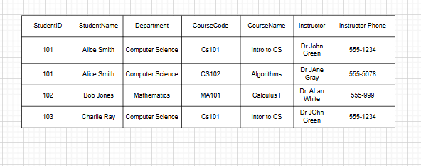
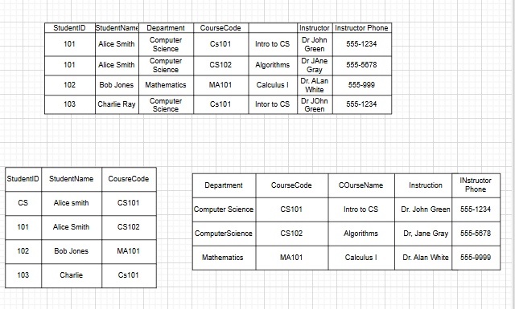
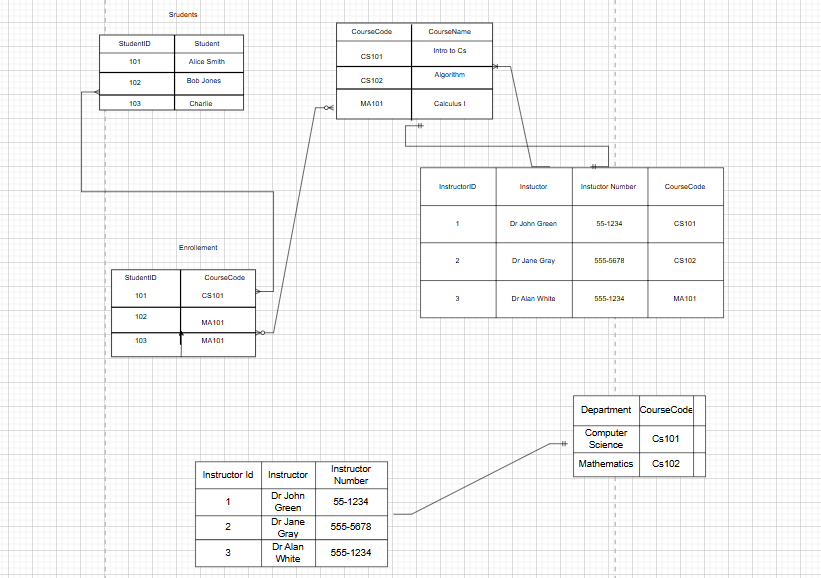

# Question 1
- Deletion Anomaly
if a student is Deleted FROM the database ,it automatically DELETEs the instructor , departments and the instructor phone number too

- Insert Anomaly
Once a student is added to a department , the instructor , instructor phone has to be added causing duplicate data creating insconsistency

- UPDATE Anomaly

If a student or an Instructor UPDATEs their name it has to be UPDATEd in the other rows.

# Question  2 

`First Normal Form`

# Question 3

`Second Normal Form`

# Question 4

`Second Normal Form`

# Question 5

Normalization eliminates redundant data and prevent anomalies.

Data Integrity to is enchanced.