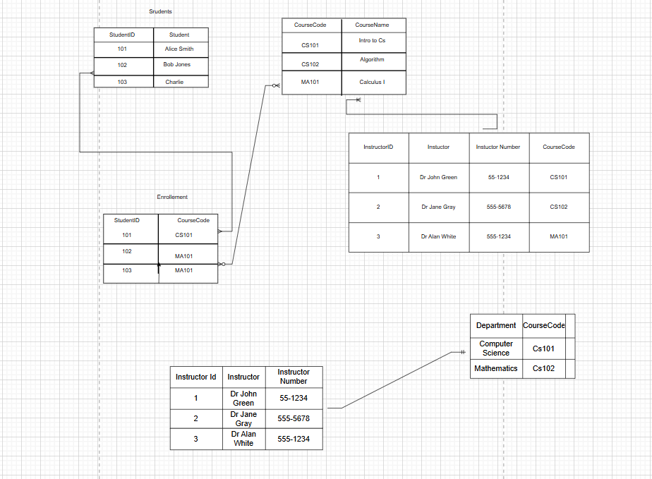

# Question 1
- Deletion Anomaly
if a student is deleted from the database it automatically deletes the instructor , departments and the instructor phone number too

- Insert Anomaly
Once a student is added to a department , the instructor , instructor phone has to be added causing duplicate data creating insconsistency

- Update Anomaly

If a student or an Instructor updates their name it has to be updated in the other rows.

# Question  2 

`First Normal Form`

# Question 3

`Second Normal Form`

# Question 4

`Second Normal Form`

# Question 5

Normalization eliminates redundant data and prevent anomalies.

Data Integrity to is enchanced.